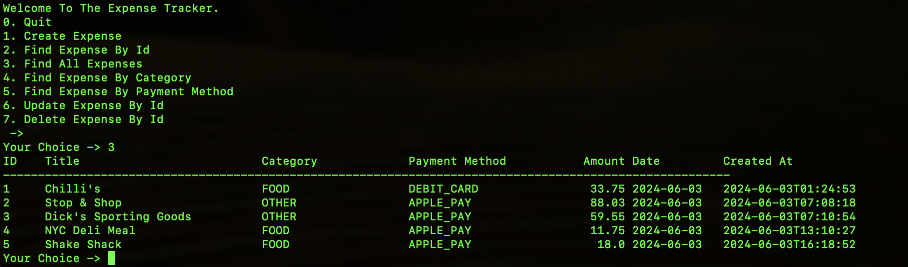

# Expense Tracker

The Expense Tracker is a Java-based application that allows users to track and manage their expenses. It provides functionality to create, find, update, and delete expenses, as well as categorize them based on different expense categories and payment methods.

## Features

- Create new expenses with details such as title, amount, category, and payment method
- Find expenses by ID, category, or payment method
- View all expenses
- Update expense details
- Delete expenses
- Enum-based expense categories and payment methods for easy categorization

## Technologies Used

- Java
- Spring Boot
- Spring Data JPA
- MySQL
- Hibernate

## Project Structure

The project follows a standard structure for a Spring Boot application:

- `com.modusami.expense_tracker.expense`: Contains the domain model, enums, and data access object (DAO) for expenses
 - `Expense.java`: Represents an expense entity
 - `ExpenseCategory.java`: Enum for expense categories
 - `ExpenseDAO.java`: Interface for expense data access object
 - `ExpenseDAOImp.java`: Implementation of the expense DAO
 - `ExpensePaymentMethod.java`: Enum for expense payment methods

- `com.modusami.expense_tracker.screen`: Contains classes for user interaction and input/output
 - `ProgramRunner.java`: Runs the expense tracker program
 - `ProgramConsoleInput.java`: Handles user input from the console
 - `ProgramConsoleOutput.java`: Handles output to the console

## Getting Started

1. Clone the repository:
2. Configure the database connection in `application.properties`.
3. Build and run the application using Maven:
4. Follow the on-screen instructions to interact with the Expense Tracker application.

## Contributing

Contributions are welcome! If you find any issues or have suggestions for improvements, please open an issue or submit a pull request.

## License

This project is licensed under the [MIT License](LICENSE).